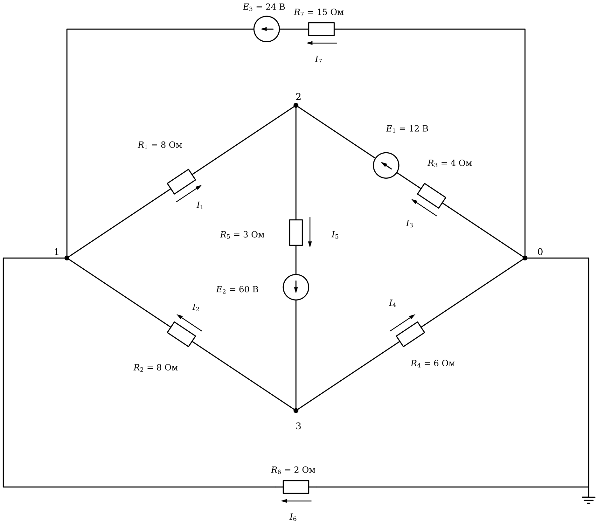

# Лабораторная работа 3. Массивы и расчёт цепей
Основы программирования · Julia · JupyterLab · 2 пары

## Вариант 6

### Общие требования

Готовый код заданий 1, 2 и исходные данные заданий 3, 4 скопируйте в свой блокнот с этой страницы.

Задания 1–5 обязательные, задания 6 и 7 — дополнительные.

Исходные числа — отдельными переменными в первых строках. Имена переменных говорят, что в них хранится, каждый результат подписан.

Под каждым заданием даны контрольные значения.

## Задание 1. Исправьте программу

Программа обрабатывает замеры напряжения за смену: считает среднее напряжение, находит наибольший замер, отклонения от номинала в процентах и число замеров вне допуска.

В программе три ошибки. Из-за одной программа останавливается с сообщением об ошибке, две другие дают неверный результат без сообщений. Найдите и исправьте все три.

```julia
# Замеры напряжения за смену
U = ["223", "213", "208", "229", "205", "223", "204", "221", "207"]   # замеры по часам, В
U_ном = 220          # номинальное напряжение, В
откл_доп = 11        # допустимое отклонение, В

# среднее напряжение
сумма = 0
for i = 1:length(U)
    сумма += U[i]
end
среднее = сумма / 8
println("Среднее напряжение: ", round(среднее, digits = 2), " В")

# медиана — средний элемент упорядоченного ряда
U_сорт = U
sort!(U_сорт)
println("Медиана: ", U_сорт[div(length(U_сорт) + 1, 2)], " В")

# наибольший замер и час, когда он снят
U_макс = U[1]
час_макс = 1
for i in 2:length(U)
    if U[i] > U_макс
        U_макс = U[i]
        час_макс = i
    end
end
println("Наибольший замер: ", U_макс, " В, час ", час_макс)

# отклонения от номинала, %
отклонения = round.((U .- U_ном) ./ U_ном .* 100, digits = 1)
println("Отклонения, %: ", отклонения)

# замеры вне допуска
вне = count(abs.(U .- U_ном) .> откл_доп)
println("Вне допуска: ", вне, " из ", length(U))
```

**Контрольные значения**

- Среднее напряжение: 214.78 В
- Медиана: 213 В
- Наибольший замер: 229 В, час 4
- Отклонения, %: [1.4, -3.2, -5.5, 4.1, -6.8, 1.4, -7.3, 0.5, -5.9]
- Вне допуска: 4 из 9

## Задание 2. Оптимизируйте программу

Программа считает ток и мощность пяти резисторов, включённых на одно напряжение, их суммарную мощность и проверяет, какие резисторы перегружены. Программа работает верно.

Оптимизируйте её. Вывод не должен измениться. После оптимизации добавление ещё одного резистора должно требовать правки одной строки.

```julia
U = 220                 # напряжение сети, В
P_доп = 700             # допустимая мощность резистора, Вт

R1 = 33
R2 = 39
R3 = 82
R4 = 100
R5 = 150

I1 = U / R1
I2 = U / R2
I3 = U / R3
I4 = U / R4
I5 = U / R5

P1 = U * I1
P2 = U * I2
P3 = U * I3
P4 = U * I4
P5 = U * I5

println("R = ", R1, " Ом: I = ", round(I1, digits = 2), " А, P = ", round(P1, digits = 1), " Вт")
println("R = ", R2, " Ом: I = ", round(I2, digits = 2), " А, P = ", round(P2, digits = 1), " Вт")
println("R = ", R3, " Ом: I = ", round(I3, digits = 2), " А, P = ", round(P3, digits = 1), " Вт")
println("R = ", R4, " Ом: I = ", round(I4, digits = 2), " А, P = ", round(P4, digits = 1), " Вт")
println("R = ", R5, " Ом: I = ", round(I5, digits = 2), " А, P = ", round(P5, digits = 1), " Вт")

println("Суммарная мощность: ", round(P1 + P2 + P3 + P4 + P5, digits = 1), " Вт")

if P1 > P_доп
    println("Резистор ", R1, " Ом перегружен")
end
if P2 > P_доп
    println("Резистор ", R2, " Ом перегружен")
end
if P3 > P_доп
    println("Резистор ", R3, " Ом перегружен")
end
if P4 > P_доп
    println("Резистор ", R4, " Ом перегружен")
end
if P5 > P_доп
    println("Резистор ", R5, " Ом перегружен")
end
```

**Контрольные значения (вывод исходной программы)**

- R = 33 Ом: I = 6.67 А, P = 1466.7 Вт
- R = 39 Ом: I = 5.64 А, P = 1241.0 Вт
- R = 82 Ом: I = 2.68 А, P = 590.2 Вт
- R = 100 Ом: I = 2.2 А, P = 484.0 Вт
- R = 150 Ом: I = 1.47 А, P = 322.7 Вт
- Суммарная мощность: 4104.6 Вт
- Резистор 33 Ом перегружен
- Резистор 39 Ом перегружен

## Задание 3. Токи по фазам

В ячейке ниже — токи трёх фаз, измеренные раз в час в течение 6 часов. Каждый замер действует 1 час.

1. Вывести матрицу таблицей: шапка «Час A B C», в каждой строке номер часа и токи. Столбцы разделять `\t`.
2. Найти наибольший ток, час и фазу, в которых он измерен.
3. Посчитать замеры выше допустимого тока и для каждого вывести час и фазу.
4. Найти мощность каждой фазы в каждый час, P = U_ф · I (кВт), энергию, потреблённую каждой фазой за смену и всего (кВт·ч, 3 знака), и её стоимость (руб., 2 знака).
5. Найти несимметрию в каждый час: (наибольший ток − наименьший) / средний ток · 100 % (1 знак). Найти час с наибольшей несимметрией и часы, в которые она выше допустимой.

```julia
I = [12.5  9.25  13.75;
     8.25  8.25  8.75;
     11.75  9.5  15.25;
     9.0  8.75  9.5;
     16.0  9.25  10.0;
     14.5  10.5  14.5]   # токи, А: строка — час, столбец — фаза

фазы = ["A", "B", "C"]
U_ф = 220          # фазное напряжение, В
I_доп = 15         # допустимый ток, А
тариф = 5.6        # стоимость, руб. за кВт·ч
несим_доп = 10     # допустимая несимметрия, %
```

**Контрольные значения**

- Наибольший ток: 16.0 А, час 5, фаза A
- Выше допустимого: 2 — час 3 фаза C, час 5 фаза A
- Энергия по фазам, кВт·ч: [15.84, 12.21, 15.785]
- Энергия всего: 43.835 кВт·ч, стоимость 245.48 руб.
- Несимметрия по часам, %: [38.0, 5.9, 47.3, 8.3, 57.4, 30.4]
- Наибольшая несимметрия — в час 5
- Несимметрия выше допустимой в часы: 1, 3, 5, 6

## Задание 4. Три способа

В ячейке ниже — замеры тока двигателя за смену. Посчитайте число замеров, которые выходят за допуск, тремя способами, каждый в отдельной ячейке:

1. цикл `for` и `if` со счётчиком;
2. без цикла, одной встроенной функцией;
3. без цикла и без `count`.

Все три способа должны дать одно и то же число.

```julia
I = [57.3, 45.1, 47.2, 47.7, 53.4, 44.2, 57.2, 48.9, 46.1, 43.8, 43.6, 49.5, 51.9, 43.4, 52.6]   # замеры тока, А
I_ном = 50       # номинальный ток, А
допуск = 10      # допустимое отклонение, %
```

**Контрольные значения**

- Вне допуска: 6

## Задание 5. Расчёт цепи методом узловых потенциалов

Узел 0 — базисный, его потенциал равен нулю. Направления токов ветвей показаны стрелками рядом с резисторами, направления ЭДС — стрелками в кружках.

Составьте систему уравнений G · φ = J для потенциалов узлов 1, 2, 3, решите её и найдите:

1. потенциалы узлов 1, 2, 3;
2. токи всех ветвей I₁…I₇; знак минус означает, что ток течёт против стрелки;
3. сумму токов в каждом из узлов 1, 2, 3 (первый закон Кирхгофа);
4. мощность источников и мощность, выделяемую на резисторах (баланс мощностей).

Число вида `1.0e-15` означает 1·10⁻¹⁵ — это ноль с погрешностью вычислений.



**Контрольные значения**

- Потенциалы узлов 1, 2, 3, В: [4.585, -10.281, 27.434]
- Токи ветвей I₁…I₇, А: [1.858, 2.856, 5.57, 4.572, 7.428, -2.292, 1.294]
- Сумма токов в каждом из узлов 1, 2, 3 равна нулю (с погрешностью порядка 1e-15)
- Мощность источников и потребителей: 543.61 Вт

## Задание 6 (дополнительное). Схема из таблицы ветвей

Запишите схему из задания 5 матрицей ветвей: одна строка — одна ветвь, столбцы — узел начала, узел конца (по стрелке тока), сопротивление R, ЭДС E. Если в ветви нет ЭДС, E = 0; ЭДС, направленная от начала ветви к концу, записывается со знаком плюс. Например, ветвь 1 вашей схемы — строка `1 2 8 0`.

Напишите программу, которая по этой матрице циклом по ветвям сама заполняет G и J, решает систему и выводит потенциалы узлов и токи ветвей. Для другой цепи с тремя узлами в программе должна меняться только матрица ветвей.

**Контрольные значения**

- Потенциалы и токи — те же, что в задании 5

## Задание 7 (дополнительное). Подбор нагрузки

В схеме задания 5 резистор R₆ = 2 Ом — нагрузка. Меняйте его сопротивление от 0.5 до 40 Ом с шагом 0.5 Ом. При каждом значении решайте систему заново и считайте мощность, выделяемую на нагрузке. Найдите сопротивление нагрузки, при котором эта мощность наибольшая, и саму мощность.

**Контрольные значения**

- Наибольшая мощность нагрузки: 12.33 Вт при R₆ = 4.5 Ом
