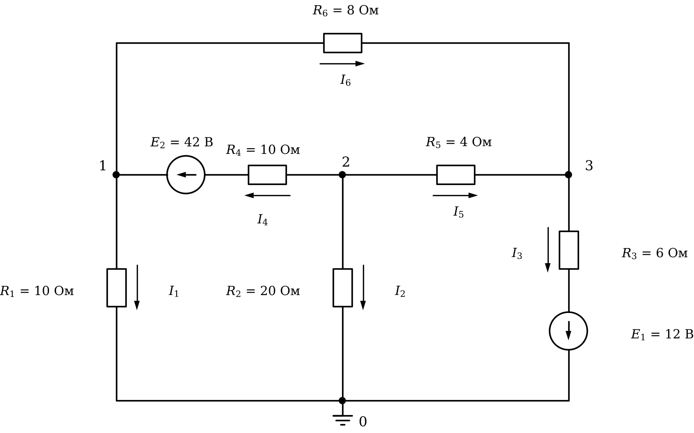

# Лабораторная работа 3. Массивы и расчёт цепей
Основы программирования · Julia · JupyterLab · 2 пары

## Вариант 9

### Общие требования

Готовый код заданий 1, 2 и исходные данные заданий 3, 4 скопируйте в свой блокнот с этой страницы.

Задания 1–5 обязательные, задания 6 и 7 — дополнительные.

Исходные числа — отдельными переменными в первых строках. Имена переменных говорят, что в них хранится, каждый результат подписан.

Под каждым заданием даны контрольные значения.

## Задание 1. Исправьте программу

Программа обрабатывает показания счётчика электроэнергии: считает расход за каждые сутки, среднесуточный расход, находит сутки с наибольшим и наименьшим расходом и сутки выше нормы.

В программе три ошибки. Из-за одной программа останавливается с сообщением об ошибке, две другие дают неверный результат без сообщений. Найдите и исправьте все три.

```julia
# Показания счётчика электроэнергии на начало каждых суток
W = ["13317.0", "13341.0", "13372.5", "13383.5", "13409.5", "13428.0", "13450.5", "13458.5"]   # кВт·ч
норма = 22        # суточная норма расхода, кВт·ч

# расход за каждые сутки
расход = Float64[]
for i in 1:length(W) - 1
    push!(расход, W[i + 1] - W[i])
end
println("Расход по суткам: ", расход)
println("Всего за период: ", sum(расход), " кВт·ч")

# среднесуточный расход
сумма = 0.0
for i = 1:length(расход)
    сумма += расход[i]
end
println("Среднесуточный расход: ", round(сумма / 6, digits = 2), " кВт·ч")

# сутки с наибольшим и наименьшим расходом
наиб = расход[1]
день_наиб = 1
наим = 0.0
for i in 2:length(расход)
    if расход[i] > наиб
        наиб = расход[i]
        день_наиб = i
    end
    if расход[i] < наим
        наим = расход[i]
    end
end
println("Наибольший расход: ", наиб, " кВт·ч, сутки ", день_наиб)
println("Наименьший расход: ", наим, " кВт·ч")
println("Наибольший расход (maximum и argmax): ", maximum(расход), " кВт·ч, сутки ", argmax(расход))

# сутки выше нормы
выше = Int[]
for i in 1:length(расход)
    if расход[i] > норма
        push!(выше, i)
    end
end
println("Сутки выше нормы: ", выше)
```

**Контрольные значения**

- Расход по суткам: [24.0, 31.5, 11.0, 26.0, 18.5, 22.5, 8.0]
- Всего за период: 141.5 кВт·ч
- Среднесуточный расход: 20.21 кВт·ч
- Наибольший расход: 31.5 кВт·ч, сутки 2
- Наименьший расход: 8.0 кВт·ч
- Наибольший расход (maximum и argmax): 31.5 кВт·ч, сутки 2
- Сутки выше нормы: [1, 2, 4, 6]

## Задание 2. Оптимизируйте программу

Программа считает энергию, которую пять приборов потребляют за месяц (мощность, Вт × часы работы в сутки × 30 дней), её стоимость, общую сумму и проверяет, какие приборы обходятся дороже предела. Программа работает верно.

Оптимизируйте её. Вывод не должен измениться. После оптимизации добавление ещё одного прибора должно требовать правки одной строки.

```julia
тариф = 4.5           # руб. за кВт·ч
дней = 30
предел = 400          # руб. в месяц

имя1 = "Стиральная машина"
имя2 = "Обогреватель"
имя3 = "Компьютер"
имя4 = "Утюг"
имя5 = "Холодильник"

P1 = 1500
P2 = 100
P3 = 1200
P4 = 200
P5 = 800

t1 = 2.0
t2 = 2.5
t3 = 4.0
t4 = 3.5
t5 = 3.0

W1 = P1 * t1 * дней / 1000
W2 = P2 * t2 * дней / 1000
W3 = P3 * t3 * дней / 1000
W4 = P4 * t4 * дней / 1000
W5 = P5 * t5 * дней / 1000

С1 = W1 * тариф
С2 = W2 * тариф
С3 = W3 * тариф
С4 = W4 * тариф
С5 = W5 * тариф

println(имя1, ": ", round(W1, digits = 1), " кВт·ч, ", round(С1, digits = 2), " руб.")
println(имя2, ": ", round(W2, digits = 1), " кВт·ч, ", round(С2, digits = 2), " руб.")
println(имя3, ": ", round(W3, digits = 1), " кВт·ч, ", round(С3, digits = 2), " руб.")
println(имя4, ": ", round(W4, digits = 1), " кВт·ч, ", round(С4, digits = 2), " руб.")
println(имя5, ": ", round(W5, digits = 1), " кВт·ч, ", round(С5, digits = 2), " руб.")

println("Всего за месяц: ", round(С1 + С2 + С3 + С4 + С5, digits = 2), " руб.")

if С1 > предел
    println(имя1, " — дороже ", предел, " руб. в месяц")
end
if С2 > предел
    println(имя2, " — дороже ", предел, " руб. в месяц")
end
if С3 > предел
    println(имя3, " — дороже ", предел, " руб. в месяц")
end
if С4 > предел
    println(имя4, " — дороже ", предел, " руб. в месяц")
end
if С5 > предел
    println(имя5, " — дороже ", предел, " руб. в месяц")
end
```

**Контрольные значения (вывод исходной программы)**

- Стиральная машина: 90.0 кВт·ч, 405.0 руб.
- Обогреватель: 7.5 кВт·ч, 33.75 руб.
- Компьютер: 144.0 кВт·ч, 648.0 руб.
- Утюг: 21.0 кВт·ч, 94.5 руб.
- Холодильник: 72.0 кВт·ч, 324.0 руб.
- Всего за месяц: 1505.25 руб.
- Стиральная машина — дороже 400 руб. в месяц
- Компьютер — дороже 400 руб. в месяц

## Задание 3. Токи по фазам

В ячейке ниже — токи трёх фаз, измеренные раз в час в течение 8 часов. Каждый замер действует 1 час.

1. Вывести матрицу таблицей: шапка «Час A B C», в каждой строке номер часа и токи. Столбцы разделять `\t`.
2. Найти наибольший ток, час и фазу, в которых он измерен.
3. Посчитать замеры выше допустимого тока и для каждого вывести час и фазу.
4. Найти мощность каждой фазы в каждый час, P = U_ф · I (кВт), энергию, потреблённую каждой фазой за смену и всего (кВт·ч, 3 знака), и её стоимость (руб., 2 знака).
5. Найти несимметрию в каждый час: (наибольший ток − наименьший) / средний ток · 100 % (1 знак). Найти час с наибольшей несимметрией и часы, в которые она выше допустимой.

```julia
I = [12.5  11.5  12.25;
     16.0  13.25  10.25;
     11.0  10.5  14.0;
     13.5  11.5  10.0;
     9.5  15.75  13.75;
     13.5  11.25  10.25;
     14.0  14.5  13.75;
     9.5  13.0  9.25]   # токи, А: строка — час, столбец — фаза

фазы = ["A", "B", "C"]
U_ф = 220          # фазное напряжение, В
I_доп = 15         # допустимый ток, А
тариф = 5.6        # стоимость, руб. за кВт·ч
несим_доп = 10     # допустимая несимметрия, %
```

**Контрольные значения**

- Наибольший ток: 16.0 А, час 2, фаза A
- Выше допустимого: 2 — час 2 фаза A, час 5 фаза B
- Энергия по фазам, кВт·ч: [21.89, 22.275, 20.57]
- Энергия всего: 64.735 кВт·ч, стоимость 362.52 руб.
- Несимметрия по часам, %: [8.3, 43.7, 29.6, 30.0, 48.1, 27.9, 5.3, 35.4]
- Наибольшая несимметрия — в час 5
- Несимметрия выше допустимой в часы: 2, 3, 4, 5, 6, 8

## Задание 4. Три способа

В ячейке ниже — замеры температуры трансформатора. Найдите номер первого замера, в котором температура выше допустимой, тремя способами, каждый в отдельной ячейке:

1. цикл `while`;
2. цикл `for` и `break`;
3. без цикла.

Все три способа должны дать одно и то же число.

```julia
T = [44.5, 41.3, 53.5, 48.8, 55.3, 40.0, 58.1, 62.3, 82.8, 69.9, 79.0, 82.3, 82.6, 62.5]   # температура по замерам, °C
T_доп = 60      # допустимая температура, °C
```

**Контрольные значения**

- Первое превышение: замер 8

## Задание 5. Расчёт цепи методом узловых потенциалов

Узел 0 — базисный, его потенциал равен нулю. Направления токов ветвей показаны стрелками рядом с резисторами, направления ЭДС — стрелками в кружках.

Составьте систему уравнений G · φ = J для потенциалов узлов 1, 2, 3, решите её и найдите:

1. потенциалы узлов 1, 2, 3;
2. токи всех ветвей I₁…I₆; знак минус означает, что ток течёт против стрелки;
3. сумму токов в каждом из узлов 1, 2, 3 (первый закон Кирхгофа);
4. мощность источников и мощность, выделяемую на резисторах (баланс мощностей).

Число вида `1.0e-15` означает 1·10⁻¹⁵ — это ноль с погрешностью вычислений.



**Контрольные значения**

- Потенциалы узлов 1, 2, 3, В: [4.311, -15.612, -9.903]
- Токи ветвей I₁…I₆, А: [0.431, -0.781, 0.35, 2.208, -1.427, 1.777]
- Сумма токов в каждом из узлов 1, 2, 3 равна нулю (с погрешностью порядка 1e-15)
- Мощность источников и потребителей: 96.92 Вт

## Задание 6 (дополнительное). Схема из таблицы ветвей

Запишите схему из задания 5 матрицей ветвей: одна строка — одна ветвь, столбцы — узел начала, узел конца (по стрелке тока), сопротивление R, ЭДС E. Если в ветви нет ЭДС, E = 0; ЭДС, направленная от начала ветви к концу, записывается со знаком плюс. Например, ветвь 1 вашей схемы — строка `1 0 10 0`.

Напишите программу, которая по этой матрице циклом по ветвям сама заполняет G и J, решает систему и выводит потенциалы узлов и токи ветвей. Для другой цепи с тремя узлами в программе должна меняться только матрица ветвей.

**Контрольные значения**

- Потенциалы и токи — те же, что в задании 5

## Задание 7 (дополнительное). Подбор нагрузки

В схеме задания 5 резистор R₂ = 20 Ом — нагрузка. Меняйте его сопротивление от 0.5 до 40 Ом с шагом 0.5 Ом. При каждом значении решайте систему заново и считайте мощность, выделяемую на нагрузке. Найдите сопротивление нагрузки, при котором эта мощность наибольшая, и саму мощность.

**Контрольные значения**

- Наибольшая мощность нагрузки: 16.282 Вт при R₂ = 6.5 Ом
