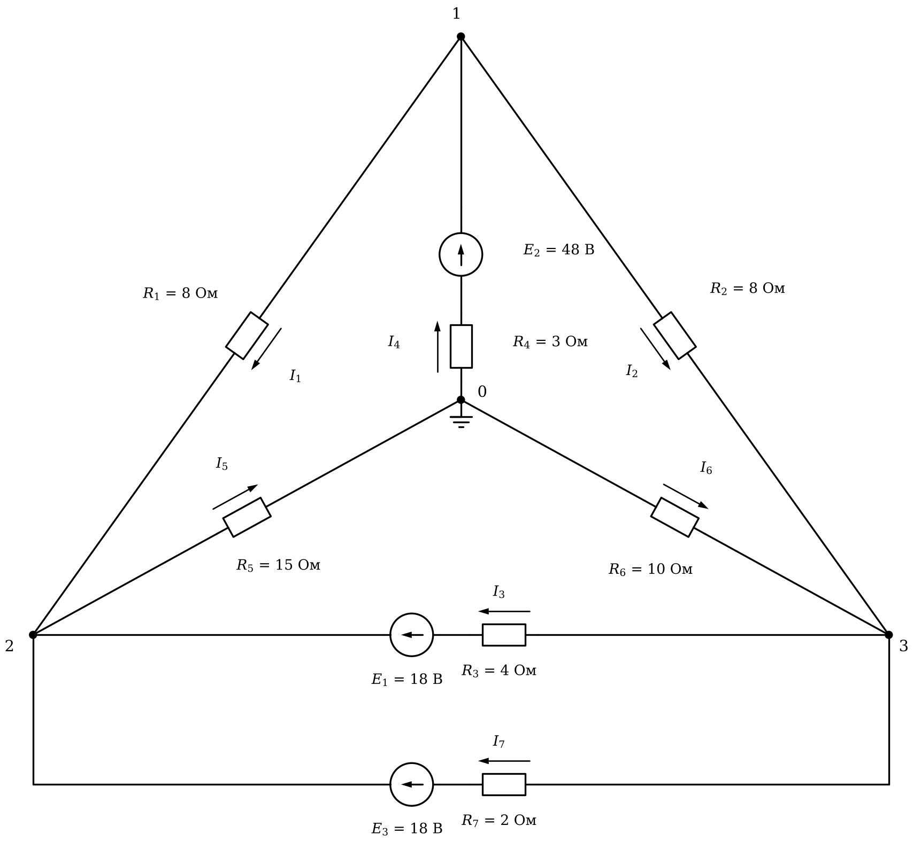

# Лабораторная работа 3. Массивы и расчёт цепей
Основы программирования · Julia · JupyterLab · 2 пары

## Вариант 15

### Общие требования

Готовый код заданий 1, 2 и исходные данные заданий 3, 4 скопируйте в свой блокнот с этой страницы.

Задания 1–5 обязательные, задания 6 и 7 — дополнительные.

Исходные числа — отдельными переменными в первых строках. Имена переменных говорят, что в них хранится, каждый результат подписан.

Под каждым заданием даны контрольные значения.

## Задание 1. Исправьте программу

Программа обрабатывает замеры температуры обмотки двигателя: считает среднюю температуру, находит первое превышение допустимой температуры, число превышений, наибольший рост температуры и запас до допустимой температуры в процентах.

В программе три ошибки. Из-за одной программа останавливается с сообщением об ошибке, две другие дают неверный результат без сообщений. Найдите и исправьте все три.

```julia
# Нагрев обмотки двигателя: замеры каждые 10 минут
T = ["44.0", "50.5", "57.5", "62.5", "65.5", "71.0", "79.0", "82.5", "89.0", "88.0"]   # температура, °C
T_доп = 70        # допустимая температура, °C

# средняя температура
сумма = 0.0
for i = 1:length(T)
    сумма += T[i]
end
println("Средняя температура: ", round(сумма / length(T), digits = 2), " °C")

# первое превышение допустимой температуры
момент = 0
for i in 1:length(T)
    if T[i] > T_доп
        момент = i
    end
    break
end
println("Первое превышение: замер ", момент, ", через ", (момент - 1) * 10, " мин")

# число замеров выше допустимой
println("Замеров выше допустимой: ", count(T .> T_доп))
println("Наибольшая температура: ", argmax(T), " °C, замер ", maximum(T))

# рост температуры между соседними замерами
рост = Float64[]
for i in 1:length(T) - 1
    push!(рост, T[i + 1] - T[i])
end
println("Наибольший рост: ", maximum(рост), " °C, между замерами ", argmax(рост), " и ", argmax(рост) + 1)

# запас до допустимой температуры, %
запас = round.((T_доп .- T) ./ T_доп .* 100, digits = 1)
println("Запас до допустимой, %: ", запас)
```

**Контрольные значения**

- Средняя температура: 68.95 °C
- Первое превышение: замер 6, через 50 мин
- Замеров выше допустимой: 5
- Наибольшая температура: 89.0 °C, замер 9
- Наибольший рост: 8.0 °C, между замерами 6 и 7
- Запас до допустимой, %: [37.1, 27.9, 17.9, 10.7, 6.4, -1.4, -12.9, -17.9, -27.1, -25.7]

## Задание 2. Оптимизируйте программу

Программа рассчитывает пять нагревателей, включённых параллельно: ток каждого, общий ток, эквивалентное сопротивление и проверяет, сработает ли автомат. Программа работает верно.

Оптимизируйте её. Вывод не должен измениться. После оптимизации добавление ещё одного нагревателя должно требовать правки одной строки.

```julia
U = 220              # напряжение сети, В
I_авт = 20           # ток срабатывания автомата, А

R1 = 22
R2 = 33
R3 = 27
R4 = 100
R5 = 68

I1 = U / R1
I2 = U / R2
I3 = U / R3
I4 = U / R4
I5 = U / R5

println("Нагреватель ", R1, " Ом: ток ", round(I1, digits = 2), " А")
println("Нагреватель ", R2, " Ом: ток ", round(I2, digits = 2), " А")
println("Нагреватель ", R3, " Ом: ток ", round(I3, digits = 2), " А")
println("Нагреватель ", R4, " Ом: ток ", round(I4, digits = 2), " А")
println("Нагреватель ", R5, " Ом: ток ", round(I5, digits = 2), " А")

I_общ = I1 + I2 + I3 + I4 + I5
R_экв = 1 / (1 / R1 + 1 / R2 + 1 / R3 + 1 / R4 + 1 / R5)
println("Общий ток: ", round(I_общ, digits = 2), " А")
println("Эквивалентное сопротивление: ", round(R_экв, digits = 2), " Ом")

if I_общ > I_авт
    println("Автомат сработает")
else
    println("Автомат не сработает")
end
```

**Контрольные значения (вывод исходной программы)**

- Нагреватель 22 Ом: ток 10.0 А
- Нагреватель 33 Ом: ток 6.67 А
- Нагреватель 27 Ом: ток 8.15 А
- Нагреватель 100 Ом: ток 2.2 А
- Нагреватель 68 Ом: ток 3.24 А
- Общий ток: 30.25 А
- Эквивалентное сопротивление: 7.27 Ом
- Автомат сработает

## Задание 3. Токи по фазам

В ячейке ниже — токи трёх фаз, измеренные раз в час в течение 6 часов. Каждый замер действует 1 час.

1. Вывести матрицу таблицей: шапка «Час A B C», в каждой строке номер часа и токи. Столбцы разделять `\t`.
2. Найти наибольший ток, час и фазу, в которых он измерен.
3. Посчитать замеры выше допустимого тока и для каждого вывести час и фазу.
4. Найти мощность каждой фазы в каждый час, P = U_ф · I (кВт), энергию, потреблённую каждой фазой за смену и всего (кВт·ч, 3 знака), и её стоимость (руб., 2 знака).
5. Найти несимметрию в каждый час: (наибольший ток − наименьший) / средний ток · 100 % (1 знак). Найти час с наибольшей несимметрией и часы, в которые она выше допустимой.

```julia
I = [10.25  10.5  10.5;
     8.5  12.0  9.5;
     14.75  14.75  14.25;
     13.0  16.0  13.0;
     9.25  12.75  15.75;
     12.5  11.25  8.25]   # токи, А: строка — час, столбец — фаза

фазы = ["A", "B", "C"]
U_ф = 220          # фазное напряжение, В
I_доп = 14         # допустимый ток, А
тариф = 5.6        # стоимость, руб. за кВт·ч
несим_доп = 10     # допустимая несимметрия, %
```

**Контрольные значения**

- Наибольший ток: 16.0 А, час 4, фаза B
- Выше допустимого: 5 — час 3 фаза A, час 3 фаза B, час 3 фаза C, час 4 фаза B, час 5 фаза C
- Энергия по фазам, кВт·ч: [15.015, 16.995, 15.675]
- Энергия всего: 47.685 кВт·ч, стоимость 267.04 руб.
- Несимметрия по часам, %: [2.4, 35.0, 3.4, 21.4, 51.7, 39.8]
- Наибольшая несимметрия — в час 5
- Несимметрия выше допустимой в часы: 2, 4, 5, 6

## Задание 4. Три способа

В ячейке ниже — замеры напряжения. Найдите, какая доля замеров (в процентах) выше среднего напряжения, тремя способами, каждый в отдельной ячейке:

1. циклы `for`: одним найти среднее, другим посчитать замеры выше него;
2. без цикла: `sum`, `length`, `count`;
3. без цикла и без `count`.

Результат округлить до 1 знака. Все три способа должны дать одно и то же число.

```julia
U = [229, 224, 219, 210, 215, 221, 222, 211, 215, 215, 229, 221]   # замеры напряжения, В
```

**Контрольные значения**

- Выше среднего: 6 из 12, 50.0 %

## Задание 5. Расчёт цепи методом узловых потенциалов

Узел 0 — базисный, его потенциал равен нулю. Направления токов ветвей показаны стрелками рядом с резисторами, направления ЭДС — стрелками в кружках.

Составьте систему уравнений G · φ = J для потенциалов узлов 1, 2, 3, решите её и найдите:

1. потенциалы узлов 1, 2, 3;
2. токи всех ветвей I₁…I₇; знак минус означает, что ток течёт против стрелки;
3. сумму токов в каждом из узлов 1, 2, 3 (первый закон Кирхгофа);
4. мощность источников и мощность, выделяемую на резисторах (баланс мощностей).

Число вида `1.0e-15` означает 1·10⁻¹⁵ — это ноль с погрешностью вычислений.



**Контрольные значения**

- Потенциалы узлов 1, 2, 3, В: [37.298, 31.156, 14.902]
- Токи ветвей I₁…I₇, А: [0.768, 2.8, 0.436, 3.567, 2.077, -1.49, 0.873]
- Сумма токов в каждом из узлов 1, 2, 3 равна нулю (с погрешностью порядка 1e-15)
- Мощность источников и потребителей: 194.8 Вт

## Задание 6 (дополнительное). Схема из таблицы ветвей

Запишите схему из задания 5 матрицей ветвей: одна строка — одна ветвь, столбцы — узел начала, узел конца (по стрелке тока), сопротивление R, ЭДС E. Если в ветви нет ЭДС, E = 0; ЭДС, направленная от начала ветви к концу, записывается со знаком плюс. Например, ветвь 1 вашей схемы — строка `1 2 8 0`.

Напишите программу, которая по этой матрице циклом по ветвям сама заполняет G и J, решает систему и выводит потенциалы узлов и токи ветвей. Для другой цепи с тремя узлами в программе должна меняться только матрица ветвей.

**Контрольные значения**

- Потенциалы и токи — те же, что в задании 5

## Задание 7 (дополнительное). Подбор нагрузки

В схеме задания 5 резистор R₂ = 8 Ом — нагрузка. Меняйте его сопротивление от 0.5 до 40 Ом с шагом 0.5 Ом. При каждом значении решайте систему заново и считайте мощность, выделяемую на нагрузке. Найдите сопротивление нагрузки, при котором эта мощность наибольшая, и саму мощность.

**Контрольные значения**

- Наибольшая мощность нагрузки: 66.628 Вт при R₂ = 5.0 Ом
