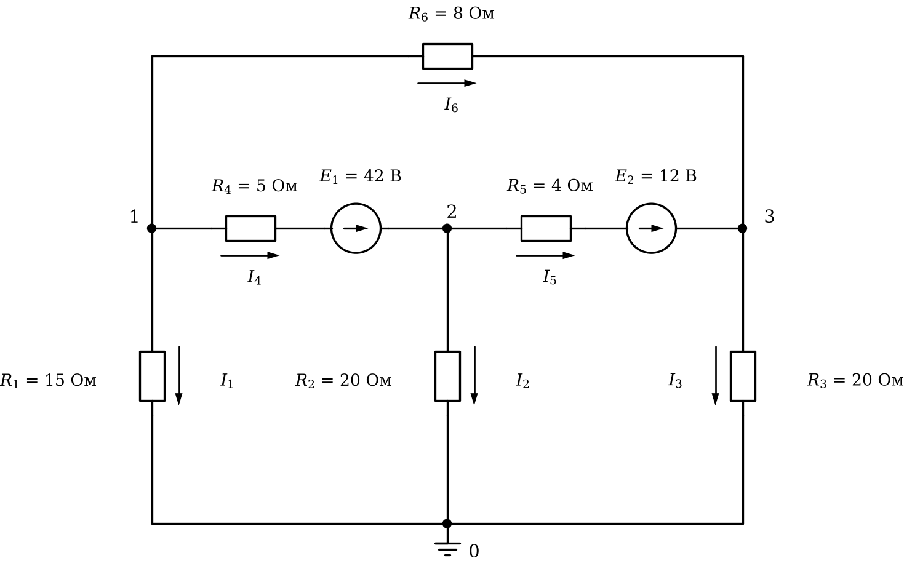

# Лабораторная работа 3. Массивы и расчёт цепей
Основы программирования · Julia · JupyterLab · 2 пары

## Вариант 17

### Общие требования

Готовый код заданий 1, 2 и исходные данные заданий 3, 4 скопируйте в свой блокнот с этой страницы.

Задания 1–5 обязательные, задания 6 и 7 — дополнительные.

Исходные числа — отдельными переменными в первых строках. Имена переменных говорят, что в них хранится, каждый результат подписан.

Под каждым заданием даны контрольные значения.

## Задание 1. Исправьте программу

Программа обрабатывает токи нагрузки за смену: считает средний ток, энергию, наибольшую мощность и наибольший ток, часы с током выше допустимого и потери в линии.

В программе три ошибки. Из-за одной программа останавливается с сообщением об ошибке, две другие дают неверный результат без сообщений. Найдите и исправьте все три.

```julia
# Токи нагрузки за смену
I = [8.0, 18.0, 17.25, 17.5, 8.0, 13.0, 13.5, 11.75, 16.75]   # ток по часам, А
U = [220, 216, 226, 222, 224, 218, 216, 224, 218]   # напряжение по часам, В
I_доп = 13        # допустимый ток, А
R_л = 0.5        # сопротивление линии, Ом

# средний ток
сумма = 0
for i = 1:length(I)
    ток = I[i]
    сумма += ток
end
println("Средний ток: ", round(сумма / length(I), digits = 2), " А")
println("Ток в последний час: ", ток, " А")

# три наибольших тока
I_сорт = I
sort!(I_сорт)
println("Три наибольших тока: ", I_сорт[end-2:end])

# мощность и энергия (каждый замер — 1 час)
P = U .* I ./ 1000      # кВт
println("Энергия за смену: ", round(sum(P), digits = 3), " кВт·ч")
println("Наибольшая мощность: ", maximum(P), " кВт, час ", argmax(P))

# наибольший ток и час
I_макс = I[1]
час = 1
for i in 2:length(I)
    if I[i] > I_макс
        I_макс = I[i]
        час = i
    end
end
println("Наибольший ток: ", I_макс, " А, час ", час)

# часы выше допустимого тока
часы_выше = Int[]
for i in 1:length(I)
    if I[i] >= I_доп
        push!(часы_выше, i)
    end
end
println("Часы выше допустимого тока: ", часы_выше)

# потери в линии
потери = sum(I .^ 2 .* R_л)      # Вт·ч
println("Потери в линии: ", round(потери, digits = 1), " Вт·ч")
```

**Контрольные значения**

- Средний ток: 13.75 А
- Три наибольших тока: [17.25, 17.5, 18.0]
- Энергия за смену: 27.257 кВт·ч
- Наибольшая мощность: 3.8985 кВт, час 3
- Наибольший ток: 18.0 А, час 2
- Часы выше допустимого тока: [2, 3, 4, 7, 9]
- Потери в линии: 912.8 Вт·ч

## Задание 2. Оптимизируйте программу

Программа рассчитывает делитель напряжения из пяти последовательно включённых резисторов: ток в цепи, падение напряжения на каждом резисторе, их сумму, и проверяет, на каких резисторах падение больше допустимого. Программа работает верно.

Оптимизируйте её. Вывод не должен измениться. После оптимизации добавление ещё одного резистора должно требовать правки одной строки.

```julia
U = 230               # напряжение источника, В
U_доп = 40            # допустимое падение напряжения на резисторе, В

R1 = 68
R2 = 27
R3 = 10
R4 = 15
R5 = 33

R_общ = R1 + R2 + R3 + R4 + R5
I = U / R_общ
println("Ток в цепи: ", round(I, digits = 3), " А")

U1 = I * R1
U2 = I * R2
U3 = I * R3
U4 = I * R4
U5 = I * R5

println("R = ", R1, " Ом: U = ", round(U1, digits = 2), " В")
println("R = ", R2, " Ом: U = ", round(U2, digits = 2), " В")
println("R = ", R3, " Ом: U = ", round(U3, digits = 2), " В")
println("R = ", R4, " Ом: U = ", round(U4, digits = 2), " В")
println("R = ", R5, " Ом: U = ", round(U5, digits = 2), " В")

println("Сумма падений: ", round(U1 + U2 + U3 + U4 + U5, digits = 2), " В")

if U1 > U_доп
    println("На резисторе ", R1, " Ом падение больше допустимого")
end
if U2 > U_доп
    println("На резисторе ", R2, " Ом падение больше допустимого")
end
if U3 > U_доп
    println("На резисторе ", R3, " Ом падение больше допустимого")
end
if U4 > U_доп
    println("На резисторе ", R4, " Ом падение больше допустимого")
end
if U5 > U_доп
    println("На резисторе ", R5, " Ом падение больше допустимого")
end
```

**Контрольные значения (вывод исходной программы)**

- Ток в цепи: 1.503 А
- R = 68 Ом: U = 102.22 В
- R = 27 Ом: U = 40.59 В
- R = 10 Ом: U = 15.03 В
- R = 15 Ом: U = 22.55 В
- R = 33 Ом: U = 49.61 В
- Сумма падений: 230.0 В
- На резисторе 68 Ом падение больше допустимого
- На резисторе 27 Ом падение больше допустимого
- На резисторе 33 Ом падение больше допустимого

## Задание 3. Токи по фазам

В ячейке ниже — токи трёх фаз, измеренные раз в час в течение 7 часов. Каждый замер действует 1 час.

1. Вывести матрицу таблицей: шапка «Час A B C», в каждой строке номер часа и токи. Столбцы разделять `\t`.
2. Найти наибольший ток, час и фазу, в которых он измерен.
3. Посчитать замеры выше допустимого тока и для каждого вывести час и фазу.
4. Найти мощность каждой фазы в каждый час, P = U_ф · I (кВт), энергию, потреблённую каждой фазой за смену и всего (кВт·ч, 3 знака), и её стоимость (руб., 2 знака).
5. Найти несимметрию в каждый час: (наибольший ток − наименьший) / средний ток · 100 % (1 знак). Найти час с наибольшей несимметрией и часы, в которые она выше допустимой.

```julia
I = [14.75  13.0  13.75;
     11.25  11.25  12.25;
     13.25  10.5  15.75;
     11.75  15.25  12.75;
     12.25  12.5  13.5;
     15.5  14.25  10.5;
     11.75  13.5  10.25]   # токи, А: строка — час, столбец — фаза

фазы = ["A", "B", "C"]
U_ф = 220          # фазное напряжение, В
I_доп = 15         # допустимый ток, А
тариф = 5.6        # стоимость, руб. за кВт·ч
несим_доп = 10     # допустимая несимметрия, %
```

**Контрольные значения**

- Наибольший ток: 15.75 А, час 3, фаза C
- Выше допустимого: 3 — час 3 фаза C, час 4 фаза B, час 6 фаза A
- Энергия по фазам, кВт·ч: [19.91, 19.855, 19.525]
- Энергия всего: 59.29 кВт·ч, стоимость 332.02 руб.
- Несимметрия по часам, %: [12.7, 8.6, 39.9, 26.4, 9.8, 37.3, 27.5]
- Наибольшая несимметрия — в час 3
- Несимметрия выше допустимой в часы: 1, 3, 4, 6, 7

## Задание 4. Три способа

В ячейке ниже — мощность нагрузки по часам. Каждый замер действует 1 час. Посчитайте энергию, потреблённую в часы, когда мощность была выше порога, тремя способами, каждый в отдельной ячейке:

1. цикл `for` и `if` с накоплением суммы;
2. без цикла: отбор по условию и `sum`;
3. без цикла и без отбора значений выше порога: из энергии за все часы вычесть энергию остальных часов.

Все три способа должны дать одно и то же число.

```julia
P = [9.0, 2.0, 5.2, 1.5, 5.7, 6.6, 8.7, 2.4, 3.1, 5.6, 8.6, 6.4]   # мощность по часам, кВт
P_порог = 6     # порог, кВт
```

**Контрольные значения**

- Энергия в часы выше порога: 39.3 кВт·ч

## Задание 5. Расчёт цепи методом узловых потенциалов

Узел 0 — базисный, его потенциал равен нулю. Направления токов ветвей показаны стрелками рядом с резисторами, направления ЭДС — стрелками в кружках.

Составьте систему уравнений G · φ = J для потенциалов узлов 1, 2, 3, решите её и найдите:

1. потенциалы узлов 1, 2, 3;
2. токи всех ветвей I₁…I₆; знак минус означает, что ток течёт против стрелки;
3. сумму токов в каждом из узлов 1, 2, 3 (первый закон Кирхгофа);
4. мощность источников и мощность, выделяемую на резисторах (баланс мощностей).

Число вида `1.0e-15` означает 1·10⁻¹⁵ — это ноль с погрешностью вычислений.



**Контрольные значения**

- Потенциалы узлов 1, 2, 3, В: [-13.749, 9.644, 8.688]
- Токи ветвей I₁…I₆, А: [-0.917, 0.482, 0.434, 3.721, 3.239, -2.805]
- Сумма токов в каждом из узлов 1, 2, 3 равна нулю (с погрешностью порядка 1e-15)
- Мощность источников и потребителей: 195.16 Вт

## Задание 6 (дополнительное). Схема из таблицы ветвей

Запишите схему из задания 5 матрицей ветвей: одна строка — одна ветвь, столбцы — узел начала, узел конца (по стрелке тока), сопротивление R, ЭДС E. Если в ветви нет ЭДС, E = 0; ЭДС, направленная от начала ветви к концу, записывается со знаком плюс. Например, ветвь 1 вашей схемы — строка `1 0 15 0`.

Напишите программу, которая по этой матрице циклом по ветвям сама заполняет G и J, решает систему и выводит потенциалы узлов и токи ветвей. Для другой цепи с тремя узлами в программе должна меняться только матрица ветвей.

**Контрольные значения**

- Потенциалы и токи — те же, что в задании 5

## Задание 7 (дополнительное). Подбор нагрузки

В схеме задания 5 резистор R₁ = 15 Ом — нагрузка. Меняйте его сопротивление от 0.5 до 40 Ом с шагом 0.5 Ом. При каждом значении решайте систему заново и считайте мощность, выделяемую на нагрузке. Найдите сопротивление нагрузки, при котором эта мощность наибольшая, и саму мощность.

**Контрольные значения**

- Наибольшая мощность нагрузки: 12.66 Вт при R₁ = 13.0 Ом
