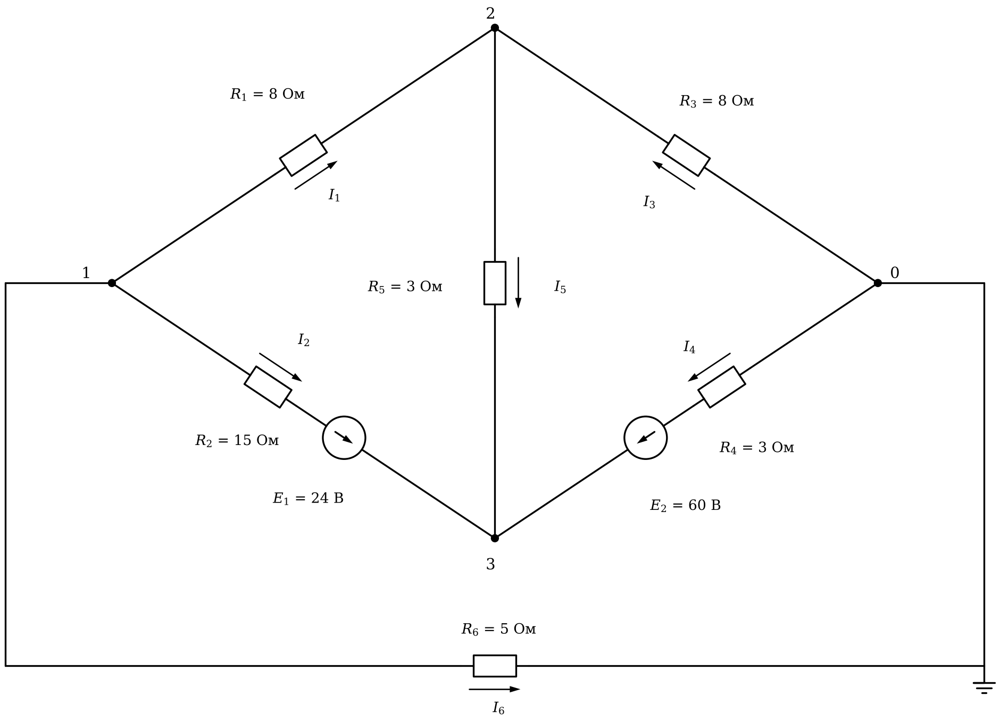

# Лабораторная работа 3. Массивы и расчёт цепей
Основы программирования · Julia · JupyterLab · 2 пары

## Вариант 18

### Общие требования

Готовый код заданий 1, 2 и исходные данные заданий 3, 4 скопируйте в свой блокнот с этой страницы.

Задания 1–5 обязательные, задания 6 и 7 — дополнительные.

Исходные числа — отдельными переменными в первых строках. Имена переменных говорят, что в них хранится, каждый результат подписан.

Под каждым заданием даны контрольные значения.

## Задание 1. Исправьте программу

Программа проверяет партию резисторов: считает среднее сопротивление, отклонения от номинала в процентах, находит бракованные резисторы, наименьшее и наибольшее сопротивление и разброс.

В программе три ошибки. Из-за одной программа останавливается с сообщением об ошибке, две другие дают неверный результат без сообщений. Найдите и исправьте все три.

```julia
# Контроль партии резисторов
R = [154.5, 161.0, 161.5, 151.0, 144.5, 162.0, 141.5, 160.5, 160.5]   # измеренные сопротивления, Ом
R_ном = 150          # номинал, Ом
допуск = 5          # допустимое отклонение, %

# среднее сопротивление
сумма = 0.0
for i = 1:length(R)
    сумма = 0.0
    сумма += R[i]
end
println("Среднее сопротивление: ", round(сумма / length(R), digits = 2), " Ом")

# отклонения от номинала, %
отклонения = (R .- R_ном) ./ R_ном .* 100
println("Отклонения, %: ", round.(отклонения, digits = 1))

# номера бракованных резисторов
брак = Int[]
for i in 0:length(R)
    if abs(отклонения[i]) > допуск
        push!(брак, i)
    end
end
println("Брак: ", брак)
println("Доля брака: ", round(length(брак) / length(R) * 100, digits = 1), " %")

# наименьшее, наибольшее и разброс
R_мин = 0
for i in 1:length(R)
    if R[i] < R_мин
        R_мин = R[i]
    end
end
println("Наименьшее: ", R_мин, " Ом")
println("Наибольшее: ", maximum(R), " Ом, резистор № ", argmax(R))
println("Разброс: ", maximum(R) - R_мин, " Ом")
```

**Контрольные значения**

- Среднее сопротивление: 155.22 Ом
- Отклонения, %: [3.0, 7.3, 7.7, 0.7, -3.7, 8.0, -5.7, 7.0, 7.0]
- Брак: [2, 3, 6, 7, 8, 9]
- Доля брака: 66.7 %
- Наименьшее: 141.5 Ом
- Наибольшее: 162.0 Ом, резистор № 6
- Разброс: 20.5 Ом

## Задание 2. Оптимизируйте программу

Программа рассчитывает линию из пяти участков: падение напряжения на каждом участке (ток участка × сопротивление провода × длина), напряжение в конце каждого участка и проверяет, где оно ниже 210 В. Программа работает верно.

Оптимизируйте её. Вывод не должен измениться. После оптимизации добавление ещё одного участка должно требовать правки одной строки.

```julia
U0 = 230              # напряжение в начале линии, В
r0 = 0.2              # сопротивление провода, Ом/км

L1 = 2.0
L2 = 1.5
L3 = 5.5
L4 = 1.0
L5 = 5.5

I1 = 30
I2 = 16
I3 = 12
I4 = 10
I5 = 10

dU1 = I1 * r0 * L1
dU2 = I2 * r0 * L2
dU3 = I3 * r0 * L3
dU4 = I4 * r0 * L4
dU5 = I5 * r0 * L5

U1 = U0 - dU1
U2 = U1 - dU2
U3 = U2 - dU3
U4 = U3 - dU4
U5 = U4 - dU5

println("Участок 1: падение ", round(dU1, digits = 2), " В, в конце ", round(U1, digits = 2), " В")
println("Участок 2: падение ", round(dU2, digits = 2), " В, в конце ", round(U2, digits = 2), " В")
println("Участок 3: падение ", round(dU3, digits = 2), " В, в конце ", round(U3, digits = 2), " В")
println("Участок 4: падение ", round(dU4, digits = 2), " В, в конце ", round(U4, digits = 2), " В")
println("Участок 5: падение ", round(dU5, digits = 2), " В, в конце ", round(U5, digits = 2), " В")

if U1 < 210
    println("В конце участка 1 напряжение ниже 210 В")
end
if U2 < 210
    println("В конце участка 2 напряжение ниже 210 В")
end
if U3 < 210
    println("В конце участка 3 напряжение ниже 210 В")
end
if U4 < 210
    println("В конце участка 4 напряжение ниже 210 В")
end
if U5 < 210
    println("В конце участка 5 напряжение ниже 210 В")
end
```

**Контрольные значения (вывод исходной программы)**

- Участок 1: падение 12.0 В, в конце 218.0 В
- Участок 2: падение 4.8 В, в конце 213.2 В
- Участок 3: падение 13.2 В, в конце 200.0 В
- Участок 4: падение 2.0 В, в конце 198.0 В
- Участок 5: падение 11.0 В, в конце 187.0 В
- В конце участка 3 напряжение ниже 210 В
- В конце участка 4 напряжение ниже 210 В
- В конце участка 5 напряжение ниже 210 В

## Задание 3. Токи по фазам

В ячейке ниже — токи трёх фаз, измеренные раз в час в течение 5 часов. Каждый замер действует 1 час.

1. Вывести матрицу таблицей: шапка «Час A B C», в каждой строке номер часа и токи. Столбцы разделять `\t`.
2. Найти наибольший ток, час и фазу, в которых он измерен.
3. Посчитать замеры выше допустимого тока и для каждого вывести час и фазу.
4. Найти мощность каждой фазы в каждый час, P = U_ф · I (кВт), энергию, потреблённую каждой фазой за смену и всего (кВт·ч, 3 знака), и её стоимость (руб., 2 знака).
5. Найти несимметрию в каждый час: (наибольший ток − наименьший) / средний ток · 100 % (1 знак). Найти час с наибольшей несимметрией и часы, в которые она выше допустимой.

```julia
I = [13.75  15.5  15.0;
     13.25  13.25  12.0;
     13.75  10.75  8.0;
     8.75  13.75  14.5;
     12.5  12.75  12.0]   # токи, А: строка — час, столбец — фаза

фазы = ["A", "B", "C"]
U_ф = 220          # фазное напряжение, В
I_доп = 14         # допустимый ток, А
тариф = 5.6        # стоимость, руб. за кВт·ч
несим_доп = 10     # допустимая несимметрия, %
```

**Контрольные значения**

- Наибольший ток: 15.5 А, час 1, фаза B
- Выше допустимого: 3 — час 1 фаза B, час 1 фаза C, час 4 фаза C
- Энергия по фазам, кВт·ч: [13.64, 14.52, 13.53]
- Энергия всего: 41.69 кВт·ч, стоимость 233.46 руб.
- Несимметрия по часам, %: [11.9, 9.7, 53.1, 46.6, 6.0]
- Наибольшая несимметрия — в час 3
- Несимметрия выше допустимой в часы: 1, 3, 4

## Задание 4. Три способа

В ячейке ниже — сопротивления десяти образцов. Найдите среднее сопротивление без наибольшего и наименьшего значения тремя способами, каждый в отдельной ячейке:

1. цикл `for`: в одном цикле найти сумму, наибольшее и наименьшее;
2. без цикла: `sum`, `maximum`, `minimum`;
3. без цикла: срез отсортированной копии.

Результат округлить до 2 знаков. Все три способа должны дать одно и то же число.

```julia
R = [99.9, 95.9, 101.9, 99.9, 104.6, 104.1, 102.1, 100.9, 96.1, 101.4]   # сопротивление образцов, Ом
```

**Контрольные значения**

- Среднее без крайних: 100.79 Ом

## Задание 5. Расчёт цепи методом узловых потенциалов

Узел 0 — базисный, его потенциал равен нулю. Направления токов ветвей показаны стрелками рядом с резисторами, направления ЭДС — стрелками в кружках.

Составьте систему уравнений G · φ = J для потенциалов узлов 1, 2, 3, решите её и найдите:

1. потенциалы узлов 1, 2, 3;
2. токи всех ветвей I₁…I₆; знак минус означает, что ток течёт против стрелки;
3. сумму токов в каждом из узлов 1, 2, 3 (первый закон Кирхгофа);
4. мощность источников и мощность, выделяемую на резисторах (баланс мощностей).

Число вида `1.0e-15` означает 1·10⁻¹⁵ — это ноль с погрешностью вычислений.



**Контрольные значения**

- Потенциалы узлов 1, 2, 3, В: [11.811, 26.985, 42.794]
- Токи ветвей I₁…I₆, А: [-1.897, -0.466, -3.373, 5.735, -5.27, 2.362]
- Сумма токов в каждом из узлов 1, 2, 3 равна нулю (с погрешностью порядка 1e-15)
- Мощность источников и потребителей: 332.95 Вт

## Задание 6 (дополнительное). Схема из таблицы ветвей

Запишите схему из задания 5 матрицей ветвей: одна строка — одна ветвь, столбцы — узел начала, узел конца (по стрелке тока), сопротивление R, ЭДС E. Если в ветви нет ЭДС, E = 0; ЭДС, направленная от начала ветви к концу, записывается со знаком плюс. Например, ветвь 1 вашей схемы — строка `1 2 8 0`.

Напишите программу, которая по этой матрице циклом по ветвям сама заполняет G и J, решает систему и выводит потенциалы узлов и токи ветвей. Для другой цепи с тремя узлами в программе должна меняться только матрица ветвей.

**Контрольные значения**

- Потенциалы и токи — те же, что в задании 5

## Задание 7 (дополнительное). Подбор нагрузки

В схеме задания 5 резистор R₁ = 8 Ом — нагрузка. Меняйте его сопротивление от 0.5 до 40 Ом с шагом 0.5 Ом. При каждом значении решайте систему заново и считайте мощность, выделяемую на нагрузке. Найдите сопротивление нагрузки, при котором эта мощность наибольшая, и саму мощность.

**Контрольные значения**

- Наибольшая мощность нагрузки: 29.132 Вт при R₁ = 6.5 Ом
